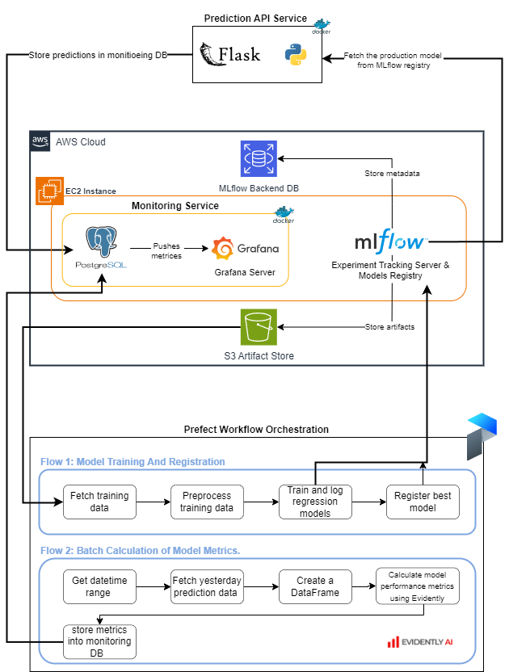

# MLOps Pipeline Project
The project is a simple demonstration of how machine learning models train, track, deploy, and monitor using MLOps tools in real world applications. 

## ML Model
The model is a simple regression model that predicts the bike ride duration based on various features. The model is trained using [Bike Rides in Washington dataset](https://s3.amazonaws.com/capitalbikeshare-data/index.html).
  
> **Note:** The main goal of the project is to demonstrate the MLOps pipeline, not to build a the best model.

## System Architecture

## Main Components
### Prefect Orchestration
Used for orchestrate model training, tracking, registering, and batch calculation of model metrics.
1. **Model Training and Registration Flow**
- Fetch traning data from S3 bucket and preprocess it.
- Train various models using different architectures and track the experiments using MLflow.
- Register the best model in the MLflow model registry.
2. **Batch Calculation Flow**
- Fetch yesterday's prediction data from PostgreSQL database.
- Calculate the model metrics using Evidently and log them into the monitoring PostgreSQL database.  

### MLflow  
Used for experiment tracking and model registry.
- Model Packaging and depenency management.
- Managing model versions.
- Managing the lifecycles of trained models.

### Flask API
Web API endpoint for model inference.
- Deployed using Docker and Gunicorn server.
- The production model is loaded from the MLflow model registry.
- The predictions are logged into the monitoring PostgreSQL database.
### Model Monitoring
After the model metrics are calculated using Evidently and logged into the monitoring PostgreSQL database, the metrics are visualized using **Grafana**.  
Calculated metrics such as:
- **Root mean squared error:** The square root of the average of the squared differences between the predicted and actual values.
- **Number of drifted features:** The number of features that have drifted from the training data distribution.
- **Share of missing values:** The percentage of missing values in the prediction data.
- **Mean absolute error:** The average of the absolute differences between the predicted and actual values.  

### AWS Cloud Services
- **EC2 Instance:** Used for hosting Mlflow server, Grafana dashboard and Monitoring DB.
- **S3 Bucket:** Used for storing the training data and model artifacts.
- **RDS PostgreSQL Database:** Used for MLflow backend store.

## Future Work
- [ ] Implement CI/CD pipeline for model deployment.
- [ ] Implement unit and integration tests.

## Acknowledgements
- [ZoomCamp](https://github.com/DataTalksClub/mlops-zoomcamp) for providing the MLOps course.